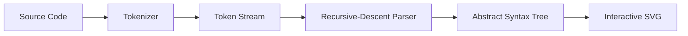

# Syntax Tree Visualizer


An interactive Compiler Design lab project that converts an educational C-like source program into tokens and an Abstract Syntax Tree (AST). The complete compiler front-end pipeline—tokenization, recursive-descent parsing, AST creation, tree layout, and visualization—is implemented in plain JavaScript.

**Live project:** [https://syntax-tree-visualizer-fwpv.onrender.com/](https://syntax-tree-visualizer-fwpv.onrender.com/)

## 1. Problem Statement

Display syntax trees graphically with these required features:

- Zoom
- Tree traversal
- Node highlighting
- An interactive compiler teaching interface

## 2. What the Project Does

1. The user writes or pastes a program in the source-code editor.
2. The tokenizer performs lexical analysis and creates a token stream.
3. The recursive-descent parser checks the grammar and operator precedence.
4. The parser constructs an Abstract Syntax Tree.
5. The layout engine assigns a position to every AST node.
6. The SVG renderer draws nodes and parent-child edges.
7. The interface displays tokens, symbols, AST JSON, statistics, and traversals.



## 3. Quick Faculty Demo

Use this sequence during the lab evaluation:

1. Open the live project.
2. Select **Advanced Program** from the Example menu.
3. Click **Generate Syntax Tree**.
4. Point out the **Nodes**, **Depth**, **Tokens**, and **Parser: Valid** statistics.
5. Click a tree node and explain its type, label, depth, and children.
6. Open the **Tokens** tab to show lexical analysis.
7. Open the **Symbols** tab to show functions, parameters, and variables.
8. Open the **AST JSON** tab to show the internal tree representation.
9. Select Preorder, Postorder, or Level-order and click **Play** or **Step**.
10. Use **+**, **−**, drag-to-pan, **Fit**, and **Reset** to demonstrate tree navigation.
11. Use **Export SVG** or download the AST JSON if required.

The Advanced Program demonstrates preprocessing input, recursion, typed functions, arrays, a `for` loop, nested `if`, `continue`, compound assignment, function calls, `printf`, and `return`.

## 4. Writing a Program Directly

Yes—the user can remove the example, type or paste a supported program, and click **Generate Syntax Tree**. **Ctrl + Enter** is the keyboard shortcut.

Example:

```c
#include <stdio.h>

int factorial(int n) {
  if (n <= 1) {
    return 1;
  }
  return n * factorial(n - 1);
}

int main(void) {
  int number = 5;
  int answer = factorial(number);
  printf("%d", answer);
  return 0;
}
```

The `#include` line is ignored because preprocessing occurs before syntax analysis in a real C compiler. The remaining source is tokenized, parsed, and visualized. This project creates the syntax tree; it does not execute the program or print its runtime result.

## 5. Supported Syntax

| Category | Supported examples |
| --- | --- |
| Variables | `let x = 10;`, `const int limit = 5;`, `unsigned long total = 0;` |
| Multiple declarations | `int a = 1, b = 2, c;` |
| Arrays | `int values[3] = {1, 2, 3};` |
| Two-dimensional arrays | `int matrix[2][2] = {{1, 2}, {3, 4}};` |
| Array indexing | `values[i]`, `matrix[row][column]` |
| Pointers | `int *ptr = &value;`, `*ptr = 9;`, `(*ptr)++;` |
| Functions | `function add(a, b) { ... }`, `int add(int a, int b) { ... }` |
| Function calls | `add(2, 3);`, `printf("%d", answer);`, `scanf("%d", &value);` |
| Conditions | `if`, `else`, nested `if`, and `else if` |
| Loops | `while`, `for`, and `do-while` |
| Control flow | `return`, `break`, and `continue` |
| Assignments | `=`, `+=`, `-=`, `*=`, `/=`, `%=`, `&=`, `\|=`, `^=`, `<<=`, `>>=` |
| Arithmetic | `+`, `-`, `*`, `/`, `%` |
| Comparison | `<`, `<=`, `>`, `>=`, `==`, `!=` |
| Logical | `&&`, `\|\|`, `!` |
| Bitwise and shift | `&`, `\|`, `^`, `~`, `<<`, `>>` |
| Updates | `++x`, `x++`, `--x`, `x--` |
| Conditional expression | `condition ? first : second` |
| Literals | Numbers, strings, characters, `true`, and `false` |
| Comments | `// single-line` and `/* block */` |
| Preprocessor input | Lines beginning with `#`, such as `#include`, are safely ignored |

Normal statements must end with a semicolon. Braces, parentheses, and brackets must be balanced.

## 6. Main Features

- Interactive SVG Abstract Syntax Tree
- Automatic large-tree fit with zoom levels down to 0.5%
- Zoom in, zoom out, mouse-wheel zoom, drag-to-pan, fit, and reset
- Clickable and keyboard-accessible nodes
- Selected-node properties and color highlighting
- Preorder, postorder, and level-order traversal
- Automatic traversal animation and manual step mode
- Token stream with line and column positions
- Basic symbol table for functions, parameters, and variables
- AST JSON view, copy, and download
- Complete-tree SVG export independent of the current zoom
- Friendly tokenizer and parser errors with exact locations
- Light and dark themes
- Responsive desktop, tablet, and mobile layout
- No framework, server, database, or external dependency

## 7. Output Panels

| Panel | Purpose |
| --- | --- |
| Visual Output | Displays the graphical AST and navigation controls |
| Node | Shows the selected node's ID, type, label, depth, and children |
| Tokens | Shows lexical tokens with line and column numbers |
| Symbols | Lists discovered functions, parameters, and variables |
| AST JSON | Shows and exports the exact JavaScript AST object |
| Grammar | Shows the main grammar and operator-precedence levels |

## 8. How to Run Locally

### Option A: Open Directly

Open `index.html` in a modern browser.

### Option B: Run a Local Server (Recommended)

Open a terminal in the project folder.

Windows:

```bash
py -m http.server 8000
```

Linux or macOS:

```bash
python3 -m http.server 8000
```

Then visit [http://localhost:8000](http://localhost:8000).

## 9. Automated Testing

Node.js is only required for running the tests; it is not required to use the website.

```bash
node tests/parser-tests.js
```

The permanent test suite currently contains **38 checks** covering:

- Valid expressions, declarations, functions, arrays, pointers, conditions, and loops
- A directly pasted C-style recursive factorial program
- Operator precedence and right-associative assignment AST structure
- Preprocessor-line handling and token source locations
- Clear rejection of invalid programs
- A 500-term stress expression

Expected final line:

```text
ALL 38 TESTS PASSED
```

## 10. Project Files

| File | Responsibility |
| --- | --- |
| `index.html` | Interface structure and compiler panels |
| `style.css` | Responsive layout, themes, nodes, and controls |
| `tokenizer.js` | Lexical analyzer and source-location tracking |
| `parser.js` | Recursive-descent parser and AST construction |
| `visualizer.js` | Tree layout, SVG rendering, zoom, pan, traversal, and export |
| `app.js` | UI events, examples, symbols, tokens, downloads, and statistics |
| `tests/parser-tests.js` | Automated valid, invalid, structural, and stress tests |
| `PROJECT_REPORT.md` | Detailed academic project report |
| `VIVA_QUESTIONS.md` | Important viva questions with short answers |

## 11. Grammar Summary

```text
program      → statement* EOF
statement    → declaration | function | expression ";"
             | "print" "(" expression ")" ";"
             | "if" "(" expression ")" statement ("else" statement)?
             | "while" "(" expression ")" statement
             | "for" "(" init ";" test ";" update ")" statement
             | "do" statement "while" "(" expression ")" ";"
             | "return" expression? ";" | "break" ";" | "continue" ";"
block        → "{" statement* "}"
declaration  → (let | var | const | type) declarator ("," declarator)* ";"
function     → ("function" | type) ID "(" parameters? ")" block
expression   → assignment | conditional
conditional  → logical-or ("?" expression ":" conditional)?
unary        → ("!" | "-" | "+" | "~" | "&" | "*" | "++" | "--") unary
             | postfix
postfix      → primary (call | index | "++" | "--")*
primary      → literal | ID | array | "(" expression ")"
```

The parser separates logical, bitwise, equality, comparison, shift, addition, multiplication, unary, and postfix levels. Therefore, an expression such as `4 + 5 * 2` correctly places multiplication below addition in the AST.

## 12. Algorithms and Complexity

| Operation | Method | Time complexity |
| --- | --- | --- |
| Tokenization | Single left-to-right scan | `O(n)` source characters |
| Parsing | Recursive descent | Typically `O(t)` tokens |
| Tree construction | One wrapper per AST node | `O(v)` nodes |
| Tree layout | Postorder position assignment | `O(v)` nodes |
| Preorder/Postorder | Depth-first traversal | `O(v)` nodes |
| Level-order | Queue-based breadth-first traversal | `O(v)` nodes |

## 13. Error Handling

Invalid input does not leave an old tree on the screen. The visualizer clears the previous result, changes the parser status to **Error**, and shows a message with the line and column.

Example invalid input:

```c
int value = 10
```

Example response:

```text
Expected ';' after variable declaration at line 1, column 15
```

## 14. Important Scope Note

This is a robust educational C-like parser, not a complete GCC, C++, or Java compiler. It intentionally focuses on lexical analysis, syntax analysis, AST construction, visualization, and traversal.

The following are outside the current scope:

- Program execution and runtime output
- Full macro expansion and preprocessing
- Structures, unions, classes, templates, and namespaces
- `switch/case`, `goto`, and labels
- Function prototypes without bodies
- Complete C/C++ declarator rules
- Semantic type checking and scope validation
- Intermediate code and machine-code generation

Keeping the grammar focused makes every implemented compiler stage visible and explainable during a lab viva.

## 15. Future Enhancements

- Add nested scopes and semantic type checking
- Add `switch/case` and structures
- Generate three-address code
- Highlight the source range belonging to a selected node
- Compare a concrete parse tree with the AST
- Add an interpreter for step-by-step execution

## 16. Viva Summary

If asked to explain the project in one sentence:

> The project performs lexical analysis and recursive-descent syntax analysis on an educational C-like program, constructs an AST, and displays it as an interactive SVG tree with traversal and node inspection.

For detailed questions and answers, see [`VIVA_QUESTIONS.md`](VIVA_QUESTIONS.md).
